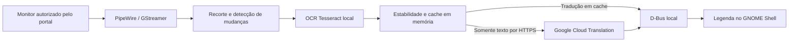

# Game Translator — Tradutor de área

Seleciona uma região da tela, reconhece o texto em inglês localmente e mostra a tradução para português brasileiro em uma legenda transparente. Independente de emulador, jogo ou aplicativo.

**Plataforma inicial:** Ubuntu 24.04, GNOME Shell 46 e Wayland, x86-64. O serviço é Rust, a interface sob demanda é GTK4/GJS e a legenda é uma extensão do GNOME. A tradução usa Google Cloud Translation Basic/NMT.

**Estado:** versão inicial 0.1.0 para testes. OCR, interface, extensão e uma chamada real de tradução foram verificados separadamente. A validação completa com emulador e as medições de desempenho durante 15 minutos ainda estão pendentes.


*A imagem mostra um teste sintético da extensão com tradução simulada; não representa uma sessão de jogo real.*

## Navegação

- [Recursos e compatibilidade](#recursos-e-compatibilidade)
- [Instalação](#instalar)
- [Primeiro uso](#usar)
- [Teste com emulador](#primeiro-teste-com-emulador)
- [Consumo de recursos](#como-mantém-o-consumo-baixo)
- [Privacidade e custos](#privacidade-custos-e-falhas)
- [Desenvolvimento](#desenvolvimento-e-testes)
- [Solução de problemas](#solução-de-problemas)

## Recursos e compatibilidade

| Item | Suporte inicial |
| --- | --- |
| Desktop | Ubuntu 24.04, GNOME Shell 46, sessão Wayland, x86-64 |
| Texto | Inglês → português brasileiro; um bloco de texto por vez |
| Aplicações | Captura de uma área do monitor, independente do emulador |
| Legenda | Transparente, com contorno e fundo translúcido opcional |
| Entrada | Preserva o foco e permite passagem de cliques durante o uso |
| OCR | Tesseract local com modelo inglês `tessdata_fast` |
| Tradução | Google Cloud Translation Basic/NMT; requer internet e credencial própria |
| Controles | Menu no painel do GNOME e atalho de pausa/retomada |

Outras versões do GNOME, KDE, X11, Windows e macOS não foram validadas. Não há tradução offline, acompanhamento automático de janelas nem seleção de várias regiões simultâneas.

## Arquitetura



O serviço Rust executa captura, OCR e rede fora do GNOME Shell. A interface GTK4 abre somente para configuração e seleção. O contrato entre componentes está em [Arquitetura e D-Bus](docs/ARCHITECTURE.md).

## Instalar

Clone o repositório na sua máquina. Se ele estiver privado, autentique sua conta GitHub antes de clonar:

```sh
git clone https://github.com/leozanchett/game-translator.git
cd game-translator
```

Confira a sessão com `gnome-shell --version` e `echo "$XDG_SESSION_TYPE"`: esta versão foi desenvolvida para GNOME 46 e `wayland`.


Rust/Cargo 1.88 ou superior deve estar disponível; consulte o [instalador oficial do Rust](https://www.rust-lang.org/tools/install). Python 3 também é usado pelo instalador. No Ubuntu, os componentes de interface e captura normalmente já estão instalados. Dependências de sistema:

```sh
sudo apt update
sudo apt install git python3 build-essential pkg-config libglib2.0-dev \
  libgstreamer1.0-dev libgstreamer-plugins-base1.0-dev \
  gstreamer1.0-pipewire gstreamer1.0-plugins-base \
  libtesseract5 tesseract-ocr-eng gjs gir1.2-gtk-4.0 gir1.2-secret-1
./scripts/install.sh
```

Alternativa **sem sudo**, em Ubuntu 24.04 x86-64 com GTK4/GJS, GLib de desenvolvimento e GStreamer já disponíveis:

```sh
./scripts/install.sh --local-deps
```

Essa opção baixa pacotes dos repositórios APT configurados, extrai os arquivos de compilação em `.deps/` e instala apenas o runtime de OCR e o modelo inglês junto da aplicação. Não modifica os pacotes do sistema. O instalador compila com `Cargo.lock`, valida o runtime e grava os arquivos em `~/.local/`.

Ative a extensão:

```sh
gnome-extensions enable area-translator@local
```

Na primeira instalação, o GNOME pode precisar que você **saia da sessão e entre novamente** para descobrir a extensão. Isso é diferente de bloquear e desbloquear a tela. Depois, abra **Tradutor de área** no menu de aplicativos ou execute `~/.local/bin/area-translator-ui`.

## Usar

1. Configure um projeto com faturamento habilitado, ative a **Cloud Translation API** e crie uma chave restrita a essa API. Siga o [guia de configuração do Google Cloud](docs/CLOUD_SETUP.md). Se a credencial já estiver no chaveiro desta sessão, não é necessário cadastrá-la novamente.
2. Cole a chave na janela e clique em **Salvar chave**. Ela fica no chaveiro do sistema, não em arquivo de configuração. Não coloque a chave no repositório.
3. Clique em **Selecionar área**, escolha um monitor no diálogo do sistema e marque a caixa de texto na prévia.
4. Se houver mais de um monitor, confirme na lista o mesmo que compartilhou. Deixe pelo menos 110 pixels lógicos livres acima ou abaixo do recorte para a legenda.
5. Clique em **Iniciar tradução**. A janela de configuração fecha; o controle fica no ícone de dicionário da barra superior.

**Super + Shift + T** pausa/retoma. O menu também permite selecionar outra área, encerrar a captura, habilitar fundo translúcido e reposicionar a legenda. Durante o reposicionamento, a captura pausa: arraste a legenda e solte. O modo termina automaticamente após 15 segundos. Fora desse modo, a legenda deixa os cliques passarem e não recebe foco.

Se o jogo mudar de posição, selecione novamente. Uma mudança de resolução ou de monitores encerra a captura para evitar usar coordenadas incorretas. A área não acompanha janelas e não há cadastro de jogos.

Bloquear a sessão oculta a legenda e pausa a tradução. Retome pelo menu ou atalho após desbloquear.

## Primeiro teste com emulador

1. Abra seu emulador e um jogo com diálogos em inglês. Escolha a resolução e a posição final da janela; se for jogar em tela cheia, entre nesse modo antes de selecionar a área.
2. Pare em um diálogo estático e legível. Abra **Tradutor de área** e selecione somente a caixa de texto, evitando elementos animados sempre que possível.
3. Autorize o monitor no diálogo do Ubuntu, marque o retângulo na prévia e inicie a tradução. Volte ao emulador.
4. Aguarde a frase estabilizar e confira a legenda em português fora da área selecionada. Avance alguns diálogos, repita um texto e teste **Super + Shift + T**.
5. Confira se o teclado e o controle continuam no emulador e se cliques atravessam a legenda. Ao mover a janela do jogo, use **Selecionar outra área**.
6. Ao terminar, encerre a captura pelo menu do tradutor.

Se a leitura estiver imprecisa, aumente o tamanho do texto ou a escala de renderização no emulador e selecione novamente. Para avaliar custo e desempenho, use uma cena reproduzível e siga o [roteiro de validação](docs/VALIDATION.md).

## Como mantém o consumo baixo

- PipeWire fornece o monitor, mas somente o recorte é convertido para escala de cinza e processado. Não há conversão contínua do monitor inteiro.
- Amostragem limitada a 5 Hz antes do mapeamento dos pixels. Buffer de captura limitado; trabalho antigo não forma uma fila crescente.
- OCR no máximo duas vezes por segundo, somente após mudanças relevantes. Modelo Tesseract inglês mantido em um trabalhador com OpenMP limitado a um thread.
- Estabilidade de texto de 500 ms reduz chamadas durante animação de letras. Fundo animado ainda pode exigir OCR repetido.
- Cache LRU de 2.000 traduções em memória, compartilhado entre seleções durante a vida do serviço.
- Apenas uma tradução em andamento. Resultados de seleções, pausas e diálogos antigos são descartados.
- Ao pausar, o pipeline entra em `Paused`; ao encerrar, a sessão do portal fecha e o modelo é liberado pelo trabalhador.
- Sem Electron, servidor web local ou inferência de tradução na GPU.

Medições preliminares: OCR em cenas sintéticas levou entre 14 e 24 ms para quadros com texto; o serviço sem captura consumiu até 12,215 MiB de RSS. **O valor em repouso não representa o consumo durante um jogo**, nem inclui GTK, incremento do Shell ou modelo carregado.

As metas de 250 MB, 5% da CPU total e menos de 3% de impacto no FPS **não são garantias**. Veja as medições executadas e as lacunas em [docs/VALIDATION.md](docs/VALIDATION.md).

## Privacidade, custos e falhas

Capturas ficam em memória. A aplicação não salva imagens nem histórico de texto em disco. Somente o texto reconhecido segue para a API oficial por HTTPS. Logs contêm tempos e contagens, sem chave, imagens ou conteúdo dos diálogos. Imagens em `tests/fixtures` e nos registros de validação são cenas sintéticas.

Requisições repetidas usam o cache; erros de rede aplicam espera progressiva de 2 até 32 segundos. Autenticação inválida ou cota esgotada suspendem captura e novas chamadas até correção e retomada manual. Cancelar uma chamada local não garante que o provedor deixe de contabilizá-la. O aplicativo não impõe um teto de gastos: configure cotas no Google Cloud.

OCR retorna vazio em leituras com baixa confiança. Fontes muito estilizadas, texto minúsculo, efeitos e cenários movimentados podem reduzir a qualidade. A primeira versão usa um bloco de texto; não reconstrói a disposição de menus complexos. Legendas muito longas são limitadas visualmente à faixa disponível. Prefira selecionar a caixa de diálogo justa.

## Desenvolvimento e testes

```sh
./scripts/dev.sh cargo test --all-targets
./scripts/dev.sh cargo test --test ocr_native -- --ignored --nocapture
./scripts/dev.sh cargo clippy --all-targets -- -D warnings
cargo fmt --check
node --test tests/geometry.mjs
glib-compile-schemas --strict --dry-run extension/schemas
./scripts/dev.sh target/release/area-translator --check
```

O teste nativo de OCR é opt-in porque precisa da biblioteca e do modelo. Ele usa seis imagens sintéticas, incluindo fonte pequena/pixelada, fundo escuro, múltiplas linhas e quadro vazio. Para regenerá-las, instale Pillow e execute `python3 scripts/make-fixtures.py`.

Testes de integração adicionais, sem tocar na sessão gráfica atual:

```sh
./scripts/dev.sh cargo build
./scripts/dev.sh dbus-run-session -- env AREA_TRANSLATOR_ISOLATED_TEST=1 bash tests/dbus-smoke.sh
./scripts/test-gnome.sh
xvfb-run -a -s '-screen 0 1200x800x24' bash tests/ui-smoke.sh
```

O teste GNOME cria um compositor isolado, carrega uma cópia instrumentada da extensão em `.deps/`, usa tradução simulada e uma aplicação de teste em tela cheia. A instrumentação não é instalada. Os testes gráficos requerem GNOME 46, Xvfb, Node e Pillow.

Arquitetura e contrato D-Bus: [docs/ARCHITECTURE.md](docs/ARCHITECTURE.md).

## Desinstalar

```sh
./scripts/uninstall.sh
```

A chave é preservada no chaveiro. Para removê-la também, apague a entrada **Area Translator — Google Cloud** no aplicativo **Senhas e chaves**.

## Solução de problemas

| Sintoma | O que verificar |
| --- | --- |
| Extensão não encontrada após instalar | Saia da sessão e entre novamente; depois execute `gnome-extensions enable area-translator@local`. |
| Legenda não aparece | Confira se a extensão está ativa, se a captura está em execução e se há espaço acima ou abaixo do recorte. |
| Diálogo de captura cancelado ou compartilhamento encerrado | Abra novamente a seleção e autorize o monitor pelo portal. |
| Texto deslocado após mover o jogo | Selecione novamente a região; suas coordenadas são fixas na tela. |
| Erro de OCR ou modelo ausente | Execute `~/.local/bin/area-translator --check`; instale o modelo inglês ou use a opção `--local-deps`. |
| Credencial inválida ou cota esgotada | Corrija a configuração no Google Cloud, atualize a chave se necessário e retome manualmente. |
| Falhas temporárias de rede | Aguarde a tentativa automática com espera progressiva; confira a conexão se persistirem. |
| Fonte estilizada ou leitura incompleta | Selecione uma caixa menor e aumente o texto no jogo; consulte os limites de OCR acima. |

## Estrutura do projeto

```text
src/                 Serviço Rust, captura, OCR, tradução e D-Bus
ui/                  Interface GTK4/GJS de configuração e seleção
extension/           Legenda, controles e atalhos do GNOME Shell
scripts/             Instalação local, desenvolvimento e medições
tests/               Testes automatizados e imagens sintéticas
docs/                Arquitetura, configuração genérica e validação
```

## Contribuir

Para relatar um problema, informe versão do Ubuntu/GNOME, tipo de sessão, escala dos monitores e passos para reproduzir. Use textos ou imagens sintéticas quando possível. Remova credenciais e informações da conta de qualquer material anexado. Alterações de código devem incluir validação proporcional ao comportamento afetado; testes de nuvem devem ser executados explicitamente com credenciais próprias.

## Licença

Código distribuído sob a [licença MIT](LICENSE). Bibliotecas e modelos mantêm suas próprias licenças; o instalador preserva os avisos dos pacotes de OCR quando os inclui na instalação local.
