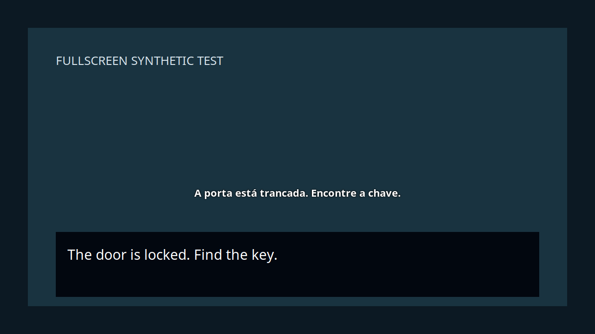
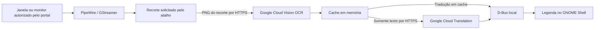

# PixelLingo — Tradução além dos pixels

Ao acionar um atalho configurável, recorta uma região de uma janela ou monitor, envia o recorte ao Google Cloud Vision para reconhecer o texto em inglês e mostra a tradução para português brasileiro em uma legenda transparente. Independente de emulador, jogo ou aplicativo.

**Plataforma inicial:** Ubuntu 24.04, GNOME Shell 46 e Wayland, x86-64. O serviço é Rust, a interface sob demanda é GTK4/GJS e a legenda é uma extensão do GNOME. O OCR usa Google Cloud Vision (`TEXT_DETECTION`) e a tradução usa Google Cloud Translation Basic/NMT.

**Estado:** versão inicial 0.1.0 para testes. O fluxo Cloud Vision → Translation foi verificado com uma imagem sintética e credencial real; interface e extensão também têm testes isolados. A validação completa com emulador e as medições de desempenho durante 15 minutos ainda estão pendentes.



*A imagem mostra um teste sintético da extensão com tradução simulada; não representa uma sessão de jogo real.*

## Navegação

- [Recursos e compatibilidade](#recursos-e-compatibilidade)
- [Instalação](#instalar)
- [Primeiro uso](#usar)
- [Teste com emulador](#primeiro-teste-com-emulador)
- [Consumo de recursos](#como-mantém-o-consumo-baixo)
- [Privacidade e custos](#privacidade-custos-e-falhas)
- [Desenvolvimento](#desenvolvimento-e-testes)
- [Solução de problemas](#solução-de-problemas)

## Recursos e compatibilidade

| Item | Suporte inicial |
| --- | --- |
| Desktop | Ubuntu 24.04, GNOME Shell 46, sessão Wayland, x86-64 |
| Texto | Inglês → português brasileiro; um bloco de texto por vez |
| Aplicações | Captura de uma janela ou monitor, com recorte interno, independente do emulador |
| Legenda | Transparente, com contorno e fundo translúcido opcional |
| Entrada | Preserva o foco e permite passagem de cliques durante o uso |
| OCR | Google Cloud Vision / TEXT_DETECTION; requer internet e credencial própria |
| Tradução | Google Cloud Translation Basic/NMT; requer internet e credencial própria |
| Controles | Tradução exclusivamente manual por atalho configurável ou botão; pausa/retomada |

Outras versões do GNOME, KDE, X11, Windows e macOS não foram validadas. Não há tradução offline nem seleção de várias regiões simultâneas. No modo janela, o recorte acompanha seu deslocamento; a legenda permanece no monitor escolhido.

## Arquitetura



O serviço Rust executa captura, OCR e rede fora do GNOME Shell. A interface GTK4 abre somente para configuração e seleção. O contrato entre componentes está em [Arquitetura e D-Bus](docs/ARCHITECTURE.md).

## Instalar

Clone o repositório na sua máquina:

```sh
git clone https://github.com/leozanchett/pixellingo.git
cd pixellingo
```

Confira a sessão com `gnome-shell --version` e `echo "$XDG_SESSION_TYPE"`: esta versão foi desenvolvida para GNOME 46 e `wayland`.


Rust/Cargo 1.88 ou superior deve estar disponível; consulte o [instalador oficial do Rust](https://www.rust-lang.org/tools/install). Python 3 também é usado pelo instalador. No Ubuntu, os componentes de interface e captura normalmente já estão instalados. Dependências de sistema:

```sh
sudo apt update
sudo apt install git python3 build-essential pkg-config libglib2.0-dev \
  libgstreamer1.0-dev libgstreamer-plugins-base1.0-dev \
  gstreamer1.0-pipewire gstreamer1.0-plugins-base \
  gjs gir1.2-gtk-4.0 gir1.2-secret-1
./scripts/install.sh
```

Alternativa **sem sudo**, em Ubuntu 24.04 x86-64 com GTK4/GJS, GLib de desenvolvimento e GStreamer já disponíveis:

```sh
./scripts/install.sh --local-deps
```

Essa opção baixa pacotes dos repositórios APT configurados, extrai os arquivos de compilação em `.deps/` e usa o runtime de captura do sistema. Não modifica os pacotes do sistema. O instalador compila com `Cargo.lock`, valida o runtime e grava os arquivos em `~/.local/`.

Ative a extensão:

```sh
gnome-extensions enable area-translator@local
```

Na primeira instalação, o GNOME pode precisar que você **saia da sessão e entre novamente** para descobrir a extensão. Isso é diferente de bloquear e desbloquear a tela. Ao atualizar uma extensão já carregada, também é necessário renovar a sessão para carregar o novo código. Depois, abra **Tradutor de área** no menu de aplicativos ou execute `~/.local/bin/area-translator-ui`.

## Usar

1. Configure um projeto com faturamento habilitado, ative **Cloud Vision API** e **Cloud Translation API** e crie uma chave restrita às duas APIs. Siga o [guia de configuração do Google Cloud](docs/CLOUD_SETUP.md). Se a credencial já estiver no chaveiro desta sessão, não é necessário cadastrá-la novamente.
2. Cole a chave na janela e clique em **Salvar chave**. Ela fica no chaveiro do sistema, não em arquivo de configuração. Não coloque a chave no repositório.
3. Em **O que capturar?**, escolha **Janela do aplicativo** (padrão) ou **Monitor inteiro**. Clique em **Selecionar área** e autorize a janela do emulador ou o monitor no diálogo do Ubuntu.
4. Marque a caixa de texto na prévia. No modo janela, escolha **Onde exibir a legenda**; no modo monitor, confirme o monitor compartilhado e deixe pelo menos 110 pixels lógicos livres acima ou abaixo do recorte.
5. Clique em **Concluir seleção**, volte ao jogo e pressione o atalho quando o texto estiver completo. Selecionar a área não inicia OCR nem tradução.

**Ctrl+A** é o atalho padrão; vale a combinação que você configurar. Cada acionamento faz **uma chamada ao Cloud Vision** e, se houver texto novo, no máximo uma chamada ao Cloud Translation. Textos conhecidos usam o cache de tradução, mas ainda passam pelo OCR online. Também é possível clicar em **Traduzir agora**. Não há tradução automática nem confirmação por três leituras. Enquanto um pedido estiver em andamento, novas pressões são agrupadas, sem criar fila. O atalho só é reservado enquanto a captura está ativa. Ao pausar ou encerrar, a combinação volta a funcionar nos outros aplicativos.

O instalador salva a combinação, sem reservá-la permanentemente. O serviço ativa o atalho ao concluir a seleção ou retomar a captura e o libera ao pausar, encerrar ou encontrar um erro que interrompa a captura. Isso funciona na sessão atual. Em uma atualização, o novo item do menu aparece quando o GNOME carregar novamente a extensão, normalmente no próximo login. Para mudar a combinação, abra o tradutor e clique em **Alterar atalho…**, pressione as teclas desejadas e clique em **Salvar**. Você também pode restaurar o padrão ou desativar o atalho; a escolha é preservada nas atualizações. A interface verifica conflitos com atalhos personalizados e atalhos comuns do GNOME. Enquanto a captura estiver ativa, a entrada também aparece em Configurações do Ubuntu → Teclado → Atalhos personalizados → **PixelLingo — Atualizar tradução**. Quando estiver parada, configure a combinação pela interface do tradutor. Pelo terminal: `~/.local/bin/area-translator-refresh`.

**Para terminar de usar**, clique em **Encerrar captura e liberar atalho** na janela do tradutor ou em **Encerrar captura** no menu da barra superior. Não é necessário fechar o serviço nem sair do Ubuntu: Ctrl+A volta a selecionar tudo nos outros aplicativos. Ao selecionar uma área novamente, o atalho salvo é reativado. Fechar somente a janela de configuração não encerra uma captura em andamento.

**Super + Shift + T** pausa/retoma. O menu também permite selecionar outra área, encerrar a captura, habilitar fundo translúcido e reposicionar a legenda. Durante o reposicionamento, a captura pausa: arraste a legenda e solte. O modo termina automaticamente após 15 segundos. Fora desse modo, a legenda deixa os cliques passarem e não recebe foco.

A legenda fica visível por **15 segundos a partir da tradução pronta**, inclusive quando ela vem do cache. Uma nova tradução substitui a anterior e reinicia os 15 segundos. Acionar o atalho, receber OCR vazio ou encontrar erro de rede não prolonga esse prazo. Pausar, encerrar ou trocar a região limpa a legenda imediatamente. No diagnóstico, acompanhe os pedidos manuais e as contagens de OCR/API.

No modo **Janela do aplicativo**, a captura contém somente a janela autorizada; mover a janela mantém o recorte relativo ao seu conteúdo. A legenda fica inicialmente no rodapé do monitor escolhido e pode ser reposicionada pelo menu. Ela não acompanha a posição da janela e não faz parte do stream capturado.

No modo **Monitor inteiro**, o retângulo permanece fixo na tela: selecione novamente se mover o jogo. A legenda fica fora desse retângulo.

Redimensionar a janela, mudar a resolução ou entrar/sair de tela cheia pode alterar as dimensões do stream; quando isso acontece, a captura encerra e solicita uma nova seleção. Alterar a configuração dos monitores também encerra a captura. Ao fechar a janela, o encerramento informado pelo portal é tratado pelo serviço. Uma janela minimizada pode deixar de fornecer quadros; use pausar/retomar ao alternar o uso. Não há cadastro de jogos.

Bloquear a sessão oculta a legenda e pausa a tradução. Retome pelo menu ou atalho após desbloquear.

No diagnóstico, **Conferir imagem enviada ao OCR** mostra um único recorte recente em escala de cinza. Use-o para verificar se a frase está inteira dentro da seleção. A imagem é solicitada somente ao clicar, fica em memória e não é salva. A prévia não faz uma chamada ao Google; o envio ocorre apenas ao pedir a tradução. Prefira selecionar a caixa de diálogo justa.

## Primeiro teste com emulador

1. Abra seu emulador e um jogo com diálogos em inglês. Escolha a resolução e a posição final da janela; se for jogar em tela cheia, entre nesse modo antes de selecionar a área.
2. Pare em um diálogo estático e legível. Abra **Tradutor de área** e selecione somente a caixa de texto, evitando elementos animados sempre que possível.
3. Escolha **Janela do aplicativo**, autorize a janela do jogo no diálogo do Ubuntu, marque o retângulo na prévia e escolha o monitor da legenda. Conclua a seleção e volte ao emulador.
4. Espere a frase terminar de aparecer, pressione seu atalho e confira a legenda em português durante 15 segundos. Avance alguns diálogos: nenhuma tradução deve acontecer até o próximo acionamento. Repita um texto para testar o cache e use **Super + Shift + T** para pausar/retomar.
5. Confira se o teclado e o controle continuam no emulador e se cliques atravessam a legenda. No modo janela, mova o emulador para conferir que a leitura acompanha seu conteúdo. Após redimensionar, use **Selecionar outra área**.
6. Ao terminar, encerre a captura pelo menu do tradutor.

Se a leitura estiver imprecisa, aumente o tamanho do texto ou a escala de renderização no emulador e selecione novamente. Para avaliar custo e desempenho, use uma cena reproduzível e siga o [roteiro de validação](docs/VALIDATION.md).

## Como mantém o consumo baixo

- PipeWire fornece a janela ou o monitor autorizado, mas somente o recorte é convertido para escala de cinza e processado. Não há conversão contínua do monitor inteiro.
- O compartilhamento permanece aberto e mantém somente uma referência ao buffer mais recente do PipeWire, sem copiar ou converter seus pixels continuamente. Isso permite traduzir também cenas estáticas, sem exigir um novo quadro após a tecla.
- Recorte e OCR ocorrem apenas por acionamento. O diagnóstico também pode solicitar um recorte, sem OCR nem rede. A codificação PNG é feita fora do ator principal; não há modelo local de OCR carregado.
- Cache LRU de 2.000 traduções em memória, compartilhado entre seleções durante a vida do serviço.
- Apenas um pedido de OCR/tradução em andamento. Resultados de seleções, pausas e diálogos antigos são descartados.
- Ao pausar, o pipeline entra em `Paused`; ao encerrar, a sessão do portal fecha e as requisições pendentes são canceladas localmente.
- Sem Electron, servidor web local ou inferência de tradução na GPU.

Em uma chamada real com imagem sintética, Cloud Vision levou 484 ms (482 ms de API), seguido de 375 ms para tradução. São observações de uma execução, não garantias de latência. As medições antigas de Tesseract não representam esta versão; consumo com OCR online durante o jogo ainda precisa ser medido.

As metas de 250 MB, 5% da CPU total e menos de 3% de impacto no FPS **não são garantias**. Veja as medições executadas e as lacunas em [docs/VALIDATION.md](docs/VALIDATION.md).

## Privacidade, custos e falhas

Capturas ficam em memória. A aplicação não salva imagens nem histórico de texto em disco. Ao acionar a tradução, o PNG em escala de cinza da **área selecionada é enviado ao Google Cloud Vision** por HTTPS. O texto extraído segue para o Google Cloud Translation. Logs contêm tempos e contagens, sem chave, imagens ou conteúdo dos diálogos. Imagens em `tests/fixtures` e nos registros de validação são cenas sintéticas.

As duas APIs podem gerar cobrança. O cache evita repetir a tradução de um texto, mas cada acionamento ainda solicita OCR online. Erros de rede impõem espera de 2 até 32 segundos antes de aceitar outro acionamento. Não há repetição automática da chamada. Autenticação inválida ou cota esgotada suspendem captura e novas chamadas até correção e retomada manual. Cancelar uma chamada local não garante que o provedor deixe de contabilizá-la. O aplicativo não impõe um teto de gastos: configure cotas no Google Cloud.

Uma resposta de OCR sem texto não dispara tradução. Fontes muito estilizadas, texto minúsculo, efeitos e cenários movimentados podem reduzir a qualidade. A primeira versão usa um bloco de texto; não reconstrói a disposição de menus complexos. A altura da legenda acompanha o texto e diminui quando a tradução encurta. No modo monitor, ela pode mudar para cima da região quando não há espaço abaixo. No modo janela, cresce para cima a partir do rodapé do monitor. Textos que excedem o espaço disponível são limitados visualmente. Prefira selecionar a caixa de diálogo justa.

## Desenvolvimento e testes

```sh
./scripts/dev.sh cargo test --all-targets
./scripts/dev.sh cargo clippy --all-targets -- -D warnings
cargo fmt --check
node --test tests/geometry.mjs
dbus-run-session -- env AREA_TRANSLATOR_ISOLATED_TEST=1 GIO_USE_VFS=local gjs -m tests/refresh-client.js
GSETTINGS_BACKEND=memory GIO_USE_VFS=local dbus-run-session -- env AREA_TRANSLATOR_ISOLATED_TEST=1 gjs -m tests/shortcut-lifecycle.js
glib-compile-schemas --strict --dry-run extension/schemas
./scripts/dev.sh target/release/area-translator --check
```

Os testes normais usam servidores HTTP locais e imagens sintéticas, sem chamadas ao Google. Para testar as duas APIs reais, com a chave já salva no chaveiro, execute explicitamente:

```sh
AREA_TRANSLATOR_CLOUD_TEST=1 ./scripts/dev.sh cargo test --test cloud_ocr -- --ignored --nocapture
```

Esse teste envia uma imagem sintética pública ao Cloud Vision e seu texto ao Translation; pode gerar cobrança. Nunca imprime a chave. As imagens de `tests/fixtures` podem ser regeneradas com Pillow e `python3 scripts/make-fixtures.py`.

Testes de integração adicionais, sem tocar na sessão gráfica atual:

```sh
./scripts/dev.sh cargo build
./scripts/dev.sh dbus-run-session -- env AREA_TRANSLATOR_ISOLATED_TEST=1 bash tests/dbus-smoke.sh
./scripts/dev.sh dbus-run-session -- env AREA_TRANSLATOR_ISOLATED_TEST=1 python3 tests/portal-smoke.py
./scripts/dev.sh dbus-run-session -- env AREA_TRANSLATOR_ISOLATED_TEST=1 cargo test --lib -- --ignored
./scripts/test-gnome.sh
xvfb-run -a -s '-screen 0 1200x800x24' bash tests/ui-smoke.sh
xvfb-run -a -s '-screen 0 1200x800x24' bash tests/ui-smoke.sh window
GSETTINGS_BACKEND=memory GDK_BACKEND=x11 GTK_A11Y=none xvfb-run -a gjs -m tests/shortcut.js
```

O teste GNOME cria um compositor isolado, carrega uma cópia instrumentada da extensão em `.deps/`, usa tradução simulada e uma aplicação de teste em tela cheia. A instrumentação não é instalada. Os testes gráficos requerem GNOME 46, Xvfb, Node e Pillow.

O teste de portal usa um serviço D-Bus simulado para conferir os pedidos de janela/monitor, o cancelamento e a ausência de suporte a janelas, sem capturar a tela nem chamar o Google. Requer Python com PyGObject (`python3-gi`). Ele não substitui o teste manual de autorização e captura real com o emulador.

Arquitetura e contrato D-Bus: [docs/ARCHITECTURE.md](docs/ARCHITECTURE.md).

## Desinstalar

```sh
./scripts/uninstall.sh
```

A chave é preservada no chaveiro. Para removê-la também, apague a entrada **Area Translator — Google Cloud** no aplicativo **Senhas e chaves**.

## Solução de problemas

Se a legenda não aparecer, abra **Tradutor de área → Diagnóstico: captura, OCR e tradução**. A página mostra os recortes solicitados, o texto lido pelo Cloud Vision, as tentativas/conclusões e os tempos separados de OCR e tradução. As contagens de OCR/API acumulam durante a vida do serviço; a contagem de quadros reinicia na seleção/retomada. Mantenha essa janela fora da área selecionada para não reconhecer a própria interface.

Se o texto lido estiver vazio ou incorreto, ajuste a região para conter somente a caixa de diálogo e confira a legibilidade. Se estiver correto, mas sem tradução, consulte o estado da API nessa mesma página. Se a tradução estiver presente no diagnóstico, mas não na tela, confira a extensão e o espaço reservado à legenda. Os dados do diagnóstico permanecem em memória.

| Sintoma | O que verificar |
| --- | --- |
| Extensão não encontrada após instalar | Saia da sessão e entre novamente; depois execute `gnome-extensions enable area-translator@local`. |
| Legenda não aparece | Após selecionar a área, pressione o atalho. Confira a extensão, o estado da captura e o diagnóstico se não aparecer. |
| Diálogo de captura cancelado ou compartilhamento encerrado | Abra novamente a seleção e autorize o monitor pelo portal. |
| Texto deslocado após mover o jogo | No modo monitor, selecione novamente; no modo janela, o recorte acompanha o conteúdo. Mudanças de tamanho exigem nova seleção. |
| Captura por janela pede extensão atualizada | A versão antiga ainda está na memória do GNOME; saia da sessão e entre novamente após instalar a atualização. |
| Erro no Cloud Vision | Confira internet, faturamento, ativação de `vision.googleapis.com` e restrição da chave às duas APIs. O `--check` verifica apenas o runtime local. |
| Credencial inválida ou cota esgotada | Corrija a configuração no Google Cloud, atualize a chave se necessário e retome manualmente. |
| Falhas temporárias de rede | Aguarde alguns segundos e pressione o atalho novamente; confira a conexão se persistirem. |
| Fonte estilizada ou leitura incompleta | Selecione uma caixa menor e aumente o texto no jogo; consulte os limites de OCR acima. |

## Estrutura do projeto

```text
src/                 Serviço Rust, captura, OCR, tradução e D-Bus
ui/                  Interface GTK4/GJS de configuração e seleção
extension/           Legenda, controles e atalhos do GNOME Shell
scripts/             Instalação local, desenvolvimento e medições
tests/               Testes automatizados e imagens sintéticas
docs/                Arquitetura, configuração genérica e validação
```

## Contribuir

Para relatar um problema, informe versão do Ubuntu/GNOME, tipo de sessão, escala dos monitores e passos para reproduzir. Use textos ou imagens sintéticas quando possível. Remova credenciais e informações da conta de qualquer material anexado. Alterações de código devem incluir validação proporcional ao comportamento afetado; testes de nuvem devem ser executados explicitamente com credenciais próprias.

## Licença

Código distribuído sob a [licença MIT](LICENSE). Bibliotecas mantêm suas próprias licenças. Não há modelo de OCR distribuído com a aplicação.
