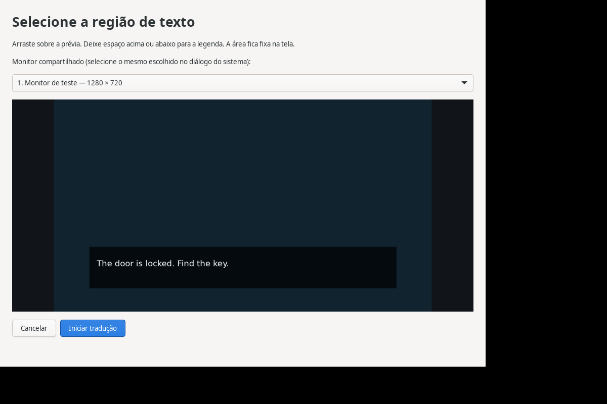

# Validação — 22/09/2026

## Ambiente

- Ubuntu, GNOME Shell 46.0 / Mutter 46.2, Wayland, x86-64.
- Ryzen 5 5600GT, 6 núcleos / 12 threads, aproximadamente 13 GiB de RAM disponível ao sistema.
- Rust 1.96.0; build release com LTO thin. GStreamer 1.24.2; Tesseract 5.3.4.
- Modelo inglês do pacote Ubuntu `tesseract-ocr-eng` 4.1.0-2; o copyright do pacote identifica o upstream como `tessdata_fast`.

## Verificações executadas

| Verificação | Resultado |
| --- | --- |
| Build release | Compilou; binário de aproximadamente 7,9 MiB, sem incluir bibliotecas compartilhadas e modelo. |
| Rust | 10 testes de unidade/contrato passaram. Cobrem recorte e stride real de buffers GStreamer, mudanças de resolução, estabilidade, resultados obsoletos e contrato HTTP com servidor local. |
| OCR nativo | Executado explicitamente nas seis imagens sintéticas abaixo. |
| Geometria da legenda | 4 testes Node passaram, incluindo origem negativa, escala fracionária e prevenção de sobreposição com o recorte. |
| D-Bus do serviço | Inicialização, rejeição de parâmetros inválidos, ausência de chamadas à API sem seleção, Stop idempotente e ausência da chave no snapshot passaram em barramento isolado. |
| GTK4 | Janela de configuração e prévia de seleção renderizaram sob Xvfb; prévia conferida visualmente. |
| Extensão GNOME 46 | Carregou em compositor isolado, exportou monitores e exibiu legenda sobre uma aplicação GTK em tela cheia. A janela de teste manteve foco; a legenda ficou `reactive=false` e `canFocus=false`, fora do retângulo do OCR. Um clique virtual na posição da legenda chegou à aplicação GTK; pausar ocultou a legenda e desativar descarregou a extensão sem erro. |
| Instalador | Instalou em prefixo isolado; launcher instalado passou em `--check`; arquivo desktop validado. |
| Google Cloud real | NMT inglês → PT-BR retornou a tradução correta de uma frase sintética em 456 ms em uma chamada isolada. Credencial restrita salva e conferida no chaveiro; nenhuma credencial integra este repositório. |

Os testes sintéticos da extensão usam respostas simuladas por D-Bus: **não equivalem à captura pelo portal nem a uma tradução real do Google**. A instrumentação fica apenas na cópia de teste em `.deps/`.

## OCR real sobre imagens sintéticas

Tempos de uma execução de desenvolvimento, um thread OpenMP; incluem pré-processamento e reconhecimento, excluem carregamento do modelo, captura e rede.

| Caso | Tempo observado | Confiança Tesseract | Resultado |
| --- | ---: | ---: | --- |
| Diálogo comum | 21 ms | 95 | Texto exato. |
| Fundo escuro | 16 ms | 95 | Texto exato. |
| Fonte pequena | 14 ms | 95 | Texto exato. |
| Fonte pixelada | 20 ms | 80 | Reconheceu as letras e pontuação, mas juntou `dragon is` em `dragonis`. |
| Duas linhas | 24 ms | 95 | Texto exato após normalizar espaços. |
| Quadro vazio | 6 ms | 0 | Resultado vazio, como esperado. |

O teste de fonte pixelada tolera diferenças de espaços explicitamente; os demais exigem correspondência exata. Esses exemplos não demonstram precisão universal em fontes de jogos.

## Consumo em repouso

Serviço release observado por **60 segundos**, sem captura, sem OCR carregado e sem chamadas à API:

- RSS máximo: **12,215 MiB**.
- CPU média: **0,0% da capacidade total**, arredondada pelo coletor baseado em `/proc`.
- 60 amostras. Registros brutos de execução permanecem locais, fora do repositório; o coletor abaixo permite reproduzir a medição.

O resultado exclui a interface GTK, o incremento de memória do GNOME Shell, o modelo carregado e os custos de captura/tradução. Não deve ser usado como estimativa do consumo ativo.

## Validação que ainda depende da sessão de uso

O Google Cloud e a credencial do aplicativo foram configurados e uma tradução real foi validada separadamente. Ainda não houve uma sessão com jogo/emulador para validar o fluxo completo. Permanecem pendentes:

- Autorizar o portal e conferir a captura PipeWire do monitor real integrada ao OCR e à tradução.
- Medir a distribuição de latência da API durante uso contínuo e validar cota/retomada com um projeto Google configurado para testes. A chamada sintética isolada já confirmou autenticação e tradução.
- Conferir seleção e legenda em vários monitores físicos, escala fracionária e troca de resolução.
- Medir **15 minutos de uso ativo**, com comparação do mesmo jogo/cena e configurações, ligado/desligado; confirmar CPU, memória adicional total e impacto no FPS.
- Validar controles reais de teclado, mouse e controle com o aplicativo usado pelo usuário.

As metas de até 250 MB adicionais, menos de 5% da CPU total, menos de 3% de impacto no FPS e tradução em até dois segundos **ainda não foram comprovadas para uso ativo**.

## Reproduzir a medição de 15 minutos

1. Execute um trecho reproduzível do aplicativo alvo, mantendo resolução, limite de FPS e opções gráficas iguais. Registre FPS e tempos de quadro pelo contador/log do próprio aplicativo durante 15 minutos, com o tradutor desligado.
2. Registre também CPU/RSS do GNOME Shell no cenário de referência. Inicie depois a tradução, feche a janela GTK e repita o mesmo trecho por 15 minutos.
3. Encontre o PID do serviço com `pgrep -x area-translator` e o do Shell com `pgrep -x gnome-shell`. Se houver mais de um resultado, use somente o processo da sessão real.
4. Execute `python3 scripts/benchmark.py --pid PID_SERVICO PID_GNOME --seconds 900 --output docs/evidence/active-15min.csv`.
5. Compare a memória do serviço mais o incremento do Shell contra a referência. CPU total é a soma das diferenças, em percentual da máquina; 100% de um núcleo equivale a aproximadamente 8,33% neste processador de 12 threads. Compare FPS e percentis de tempo de quadro registrados pelo aplicativo; RSS sozinho não mede impacto gráfico.

O coletor lê somente `/proc`; ele não grava telas. Para tempos de OCR/API, execute o serviço em primeiro plano com `RUST_LOG=area_translator=info` e armazene os logs de métricas. Eles não contêm o texto reconhecido.

## Ajustes após o primeiro teste com emulador

- Adicionado diagnóstico local de quadros, leitura/confiança do OCR, chamadas à API e tradução, atualizado somente enquanto sua página está aberta.
- Seleções com mais de 400 pixels de altura passam a usar segmentação automática do Tesseract; recortes menores mantêm o modo de bloco único. A escolha reduz a suposição de que uma seleção com cenário constitui um único parágrafo, mas não substitui um recorte adequado.
- Sete imagens sintéticas passaram pelo OCR nativo, incluindo diálogo sobre cenário; o caso de cenário obteve confiança 95 e texto exato. O teste também alterna novamente para o recorte pequeno no mesmo trabalhador.
- Cinco testes de geometria passaram. No compositor GNOME isolado, a legenda cresceu com uma tradução longa e encolheu com uma curta, mantendo-se fora da área de captura. Passagem de cliques e foco continuaram funcionando.
- A evidência enviada durante a depuração foi analisada localmente; não integra o repositório. As metas de consumo durante 15 minutos continuam pendentes.

## Captura por janela — 23/09/2026

- 11 testes Rust e 6 de geometria passaram, incluindo recorte de janela independente da proporção/posição do monitor de saída e pedido de nova seleção após mudança de dimensões.
- O teste com portal simulado executou o serviço Rust real: confirmou `types=2` para janela, `types=1` para monitor, cursor oculto, uma fonte, limpeza após cancelamento e erro sem abrir sessão quando o sistema não oferece captura de janelas. Nenhuma chamada à API foi feita.
- No GNOME 46 isolado, uma legenda com origem de janela permaneceu no rodapé do monitor e cresceu para cima com texto longo, mesmo com recorte de 640 × 480 e monitor de 1280 × 720. A extensão também passou pelo fluxo anterior de monitor, preservação de foco e passagem de cliques.
- Ambas as prévias GTK foram renderizadas e inspecionadas. A seleção por janela identifica o monitor como destino da legenda e não exige a mesma proporção entre janela e monitor.
- A instalação local é atualizada; carregar o novo código da extensão requer renovar a sessão do GNOME. A UI detecta a versão antiga e informa essa necessidade antes de iniciar captura por janela.
- A autorização pelo portal real, o deslocamento/minimização da janela do emulador e a captura de tela cheia precisam ser conferidos em sessão de uso. Os testes de portal simulado e de geometria não comprovam esses comportamentos do compositor real.
